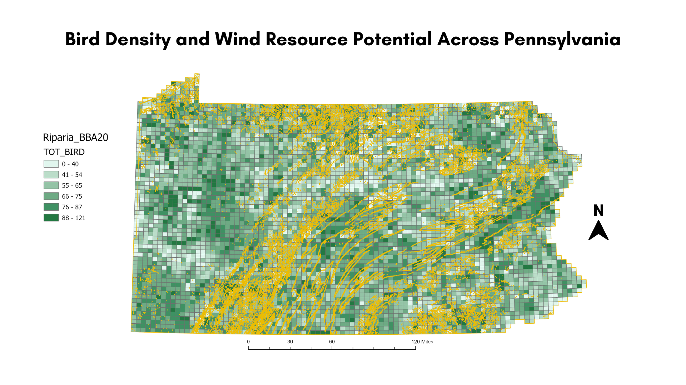

# Bird Density and Wind Resource Potential Across Pennsylvania

## Project Overview

This project visualizes the spatial relationship between bird observation density and wind resource potential across Pennsylvania.

The goal is to explore whether areas with strong wind energy potential overlap with regions of high bird activity, which may require additional ecological consideration for wind turbine placement.

## Map

## Data Sources

- Pennsylvania Breeding Bird Atlas (Riparian dataset)
- Wind resource potential dataset

Both datasets were obtained from the Pennsylvania Spatial Data Access (PASDA) clearinghouse.

## Methods

1. Bird observation counts were aggregated by riparian mapping units.
2. Observations were symbolized using graduated colors representing total bird counts.
3. Wind resource potential was added as an orange overlay layer.
4. The datasets were combined to visually compare ecological sensitivity with renewable energy potential.

## Reference

Pennsylvania Spatial Data Access (PASDA).  
https://www.pasda.psu.edu/
